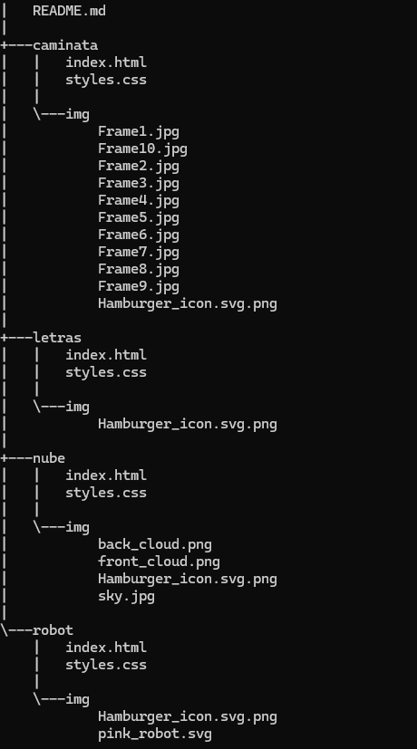

# REPASO 
Repaso es un repositorio donde contiene cuatro carpetas donde trabaje animaciones y menus hamburguesa.
 
## Descripción

En cada carpeta cuenta con un menu de hamburguesa despegable donde tiene hipervinculos que los lleva a las otras animaciones. 

## Estructura de las carpetas

1. **Caminata**: Desarrollo de caminata de una persona con uso de un desplege de imagenes. 

- `index.html`: Estructuración de la animación.
- `styles.css`: Mejoramiento de estilos de la caminata, utilizano animaciones, ejecucuion del menu hamburguesa.
- `img/`: En esta carpeta contiene 10 recortes del personaje para poder hacer que camine. 

2. **Letras**: Desarrollo de movientos de la palabra UP&OVER donde contiene unas breves rotaciones. 

- `index.html`: Estructuración de la palabra.
- `styles.css`: Mejoramiento en los estilos de la palabra, dandoles las animaciones donde su funcion era generar unas breves rotaciones ejecución del menu de hamburgusas.

3. **Nube**: Desarrollo de movimientos de dos nubes donde su funcion era que su movimiento fuera constante y una se moviera mas lento que la otra . 

- `index.html`: Estructuracion de la animación.
- `styles.css`: Mejoramiento de estilos del fondo de las nuebes, con ayuda de las animaciones realizar los movimientos correspondiente de cada nube haciendo sus movimientos infinitos y ejecución del menu de hamburgusas.
- `img/`: En esta carpeta contiene las imagenes para la creacion de la animación. 

4. **Robot**: Elaboración de cuadro de texto donde su movimiento es que aparesca desde la parte inferior de la pantalla y realice un pequeño rebote en la parte superior de ella. 

- `index.html`: Estructuración de la animacion.
- `styles.css`: Mejoramiento de estilos de cuadro de texto, utilizano animaciones, ejecucuion del menu hamburguesa.
- `img/`: En esta carpeta contiene la imagenes utilizada para el desarrollo de la animación.

## Tecnologías usudas
En todas las carpetas hice uso de dos tecnologías:

* HTML5 
* CSS3

## Caracteristicas del repositorio:

* Cada carpeta cuenta con un menu de hamburgusa despegable donde contiene hipervinculo.
* Animaciones interactivas

## Instrucciones de uso

* Clonar el repositorio o descargarlo.
* Abrir cualquier archivo index.html que se encuentra dentro del repositorio clonado o descargado.

## Créditos

Este proyecto fue elaborado por Zully Fernanda Ortiz Avendaño como objetivo de reforzar y mejorar mis conocimientos y habilidades en HTML y CSS con la parte de animaciones y implementacióin de menus hamburguesas.